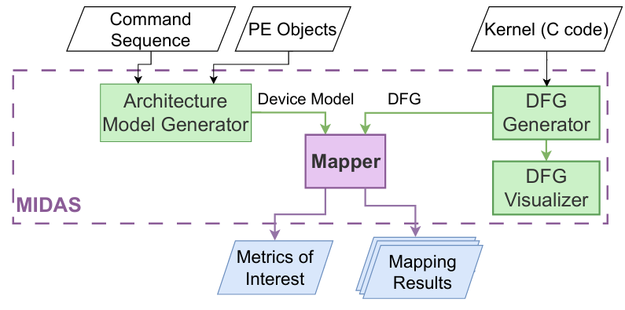

# MIDAS - Mapping Infrastructure for Data Streaming Accelerators

### Publication

If you use this software in a publication, please cite the following paper:

```bibtex
@INPROCEEDINGS{11264642,
  author={Bento, Martim and Neves, Nuno and Tomás, Pedro and Roma, Nuno},
  booktitle={2025 IEEE/SBC 37th International Symposium on Computer Architecture and High Performance Computing (SBAC-PAD)}, 
  title={MIDAS: A Mapping Infrastructure for Configurable, Data-Streaming Based Domain Specific Accelerators}, 
  year={2025},
  volume={},
  number={},
  pages={24-34},
  keywords={Measurement;High performance computing;Performance gain;Parallel processing;Energy efficiency;Space exploration;Reconfigurable architectures;Arrays;Kernel;Optimization;Reconfigurable Architectures;Data Streaming;Toolchain;Mapping},
  doi={10.1109/SBAC-PAD66369.2025.00013}}
```

## Overview
MIDAS is a tool designed for mapping applications onto stream-based Coarse-Grained Reconfigurable Architectures (CGRAs). It is capable of receiving applications (C code), generating the corresponding compute-only DFGs and mapping them onto the target device, yielding the results in a JSON file.



MIDAS assumes a given Processing Element (PE) Array template, as described in the paper. The array is synchronous. Thus, the mapping output is always a sequence of periodically repeating contexts, each of which features the configuration descriptions for all PEs in a given modulo cycle (cycle % II). Each PE features a cross-bar/multiplexer connections that allow it to simultaneously and independently use the PE for routing and computing values. As such, within a given cycle, each PE can simultaneously compute a value and send it to the output register, while storing some externally received value in its local Register File, or compute a value and store it in the local Register File, while simultaneously forwarding an externally received value to the output register.

### Prerequisites

This project was tested on both the **Ubuntu 24.04.2 LTS** and **Rocky Linux 8.6 (Green Obsidian)** operating systems.

- `GCC ≥ 8.5.0`

- `Python ≥ 3.12.3`

Required non-standard Python packages:

```bash
pip install networkx matplotlib
```

### Installation

Clone the repository. Then, in the main folder, compile the project:

```bash
make
```

Then make sure that the provided shell scripts have execution permissions:
```bash
chmod +x map_dfg.sh
chmod +x customBench.sh
```

### Getting Started

The **MIDAS** tool can be run alone or with scripts. When running the executable alone, the commands are to be inserted manually by the user. The `help` command shows and describes all of the available commands. The scripts available in the *scripts* folder contain several of these commands which are thus automatically run when a script is used as input.

The `axpy.mcl` script is a basic script which imports the axpy DFG (as a DOT file), as well as the device model, maps the DFG onto the design, displays several co-design metrics and finally exports the mapping information as a JSON file.

To map any DFG in a single pass, the `map_dfg.sh` shell script was devised. This script fetches the target DOT file and runs the `default.mcl` MIDAS script, effectively mapping any DOT file without having to manually change the MIDAS scripts.

Example Command:
```bash
./map_dfg.sh benchmarks/stream_microbench/axpy/axpy.dot
```
This fetches the axpy DFG (assuming the data streaming paradigm) and maps it onto the target device.

The mapping output is generated with the command 'export_mapping `<filename>`', where `<filename>` defaults to `mapping_results` by omission. In the provided scripts, `<filename>` is set to 'res'. The output json file features the obtained II, array size, and the configuration info for each PE, as well as IO locations. The information for each PE includes which inputs it receives (input port and operation), which value is written to the local register file (and which address), as well as default information (its 'grid' location and Register File Size).

### Building Custom DFGs

To allow users to test custom DFGs, a generator is included, which automatically builds the compute-only DFGs from target compute only kernels. To test your custom benchmarks, edit the /benchmarks/benchmark.c file, by modifying specifically the loop body. Then, run the `customBench.sh` script. This script automatically generates the compute-only DFG and stores it as `simplified_loop.dot`. The DFG can be visualized with the `-v` argument when running `customBench.sh`. Alternatively, the `dfg_visualizer.py` file, available in the src/ folder, performs this task. The DFG can then be mapped by running the `map_dfg.sh` with `simplified_loop.dot` as argument.

### Preparing the target PE Array

The device model information is stored in an internal representation (.cmpa file) and can then be fetched by MIDAS, via the `import_cgra` command. To generate the device model, an architecture model generator was devised.

`architectures/arch_generator.py` automatically generates a target device model (assuming data streaming). To adapt the array for mapping the complete CDFGs, `architectures/nonstreaming_array.py` generates a model where all PEs support control and memory operations (e.g. load/store, phi nodes, branches). To create a target device model, a custom file, with the same structure as the previous generators, should be created. The python file requires the same libraries as `arch_generator.py` and should be developed in the same folder. Alternatively, `arch_generator.py` itself can be modified. There are several methods available for the generation of custom arrays, which include (but are not limited to):

- `init_standard_cgra(Rows, Cols, StreamPorts, MergeIOs)` creates an array template automatically, assuming purely adjacent connections. `StreamPorts` defines where the stream ports should be placed (left, right, up, down, or all), while `MergeIOs` sets all ports to both Inputs AND Outputs when set to true (it is set to false by default). By default, when setting `StreamPorts` to 'all' and `MergeIOs` to 'False', input ports are generated at the top and left parts of the array, while the outputs are generated in the other parts.

- `init_empty_MPA(Rows, Cols, StreamPorts)` creates an array similarly to the previous command, but without any connections.

- `add_funct_to_PEs(funct)` adds function `funct` to all PEs in the array

- `add_interconnect(position, position, latency, export=True/False)`

- `add_wrap_around_interconnects(latency, side)` adds wrap around connections to the array

- `set_pe_registerFile_sizes(Register File Size)` defines the Register File Size for all PEs in the array

- `set_all_pe_num_output_registers(Num_Registers)`

- `addRfReadPortsToAllPEs("FU"/"OutputRegisters", Num)` adds RF read ports to either the FU or Output Registers

### Acknowledgements

Work supported by national funds through Fundação para a Ciência e a Tecnologia (FCT) under project 2022.06780.PTDC (DOI: 10.54499/2022.06780.PTDC). We also acknowledge the contributions from project UID/50021/2025 and UID/PRR/50021/2025.

The `parson` (https://github.com/kgabis/parson?tab=readme-ov-file) library was employed for parsing the JSON files, abiding by the MIT license. 


